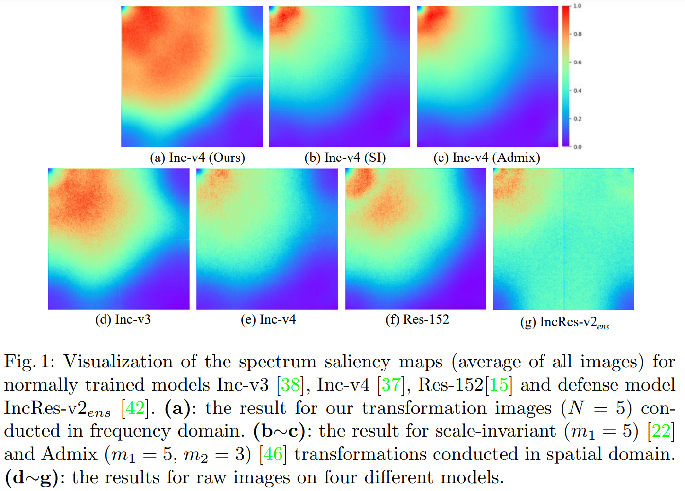
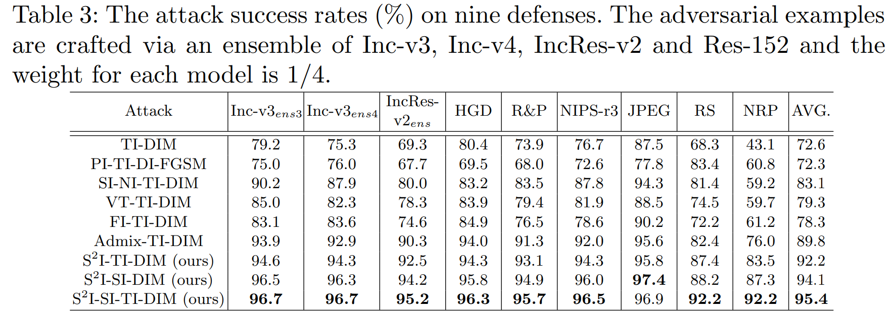

# Spectrum Simulation Attack (ECCV'2022 ORAL)

This repository is the official **Pytorch** code  implementation for our paper [Frequency Domain Model Augmentation for Adversarial Attack](https://arxiv.org/abs/2207.05382). In this paper, we propose a novel **spectrum simulation attack** to craft more transferable adversarial examples against both normally trained and defense models. Specifically, we apply a **spectrum transformation** to the input and thus perform the model augmentation in the **frequency domain**. We theoretically prove that the transformation derived from frequency domain leads to a diverse **spectrum saliency map**, an indicator we proposed to reflect the diversity of substitute models. Notably, our method can be generally combined with existing attacks. Extensive experiments on the ImageNet dataset demonstrate the effectiveness of our method, *e.g.*, attacking nine state-of-the-art defense models with an average success rate of **95.4%**.

# Motivation


## Requirements

- python 3.8
- torch 1.8
- pretrainedmodels 0.7
- numpy 1.19
- pandas 1.2


## Implementation

- **Prepare models**

  Download pretrained models [here](https://github.com/ylhz/tf_to_pytorch_model), which have converted common Tensorflow models used in adversarial attacks to PyTorch models. Then put these models into `.models/`

- **Generate adversarial examples**

  Using `attack.py` to implement our S<sup>2</sup>I-FGSM,  you can run this attack as following
  
  ```bash
  CUDA_VISIBLE_DEVICES=gpuid python attack.py --output_dir outputs
  ```
  where `gpuid` can be set to any free GPU ID in your machine. And adversarial examples will be generated in directory `./outputs`.
  
- **Evaluations on normally trained models**

  Running `verify.py` to evaluate the attack  success rate

  ```bash
  CUDA_VISIBLE_DEVICES=gpuid python verify.py
  ```

- **Evaluations on nine defenses**

    To evaluate the attack success rates on defense models, we test eight defense models which contain three adversarial trained models (Inc-v3<sub>*ens3*</sub>, Inc-v3<sub>*ens4*</sub>, IncRes-v2<sub>*ens*</sub>) and six more advanced models (HGD, R&P, NIPS-r3, RS, JPEG, NRP).

    - [Inc-v3<sub>*ens3*</sub>,Inc-v3<sub>*ens4*</sub>,IncRes-v2<sub>*ens*</sub>](https://github.com/ylhz/tf_to_pytorch_model):  You can directly run `verify.py` to test these models.
    - [HGD](https://github.com/lfz/Guided-Denoise), [R&P](https://github.com/cihangxie/NIPS2017_adv_challenge_defense), [NIPS-r3](https://github.com/anlthms/nips-2017/tree/master/mmd): We directly run the code from the corresponding official repo.
    - [RS](https://github.com/locuslab/smoothing): noise=0.25, N=100, skip=100. Download it from corresponding official repo.
    - [JPEG](https://github.com/JHL-HUST/VT/blob/main/third_party/jpeg.py): Refer to [here](https://github.com/JHL-HUST/VT/blob/main/third_party/jpeg.py).
    - [NRP](https://github.com/Muzammal-Naseer/NRP): purifier=NRP, dynamic=True, base_model=Inc-v3<sub>*ens3*</sub>. Download it from corresponding official repo.

## Result




## Citation

If you find this work is useful for your research, please consider citing our paper:
```
@inproceedings{Long2022ssa,
  author    = {Yuyang Long and 
               Qilong Zhang and 
               Boheng Zeng and
               Lianli Gao and 
               Xianglong Liu and 
               Jian Zhang and 
               Jingkuan Song},
  title     = {Frequency Domain Model Augmentation for Adversarial Attack},
  Booktitle = {European Conference on Computer Vision},
  year      = {2022}
}
```
